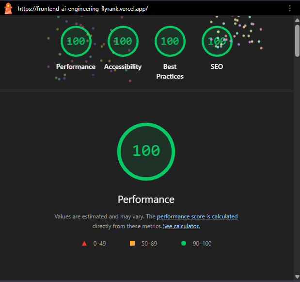
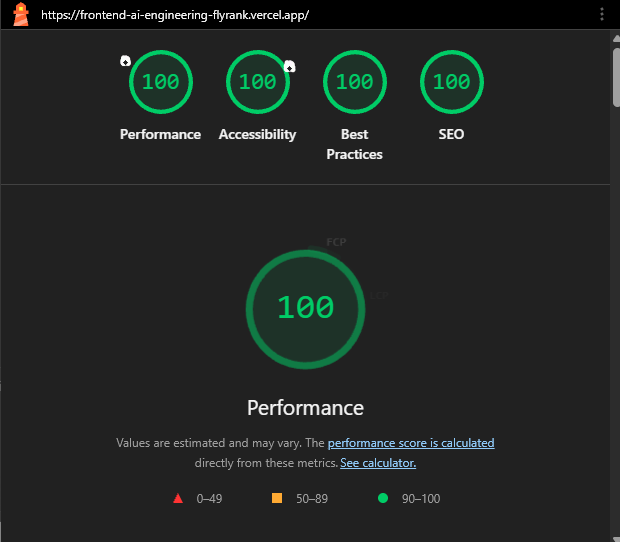
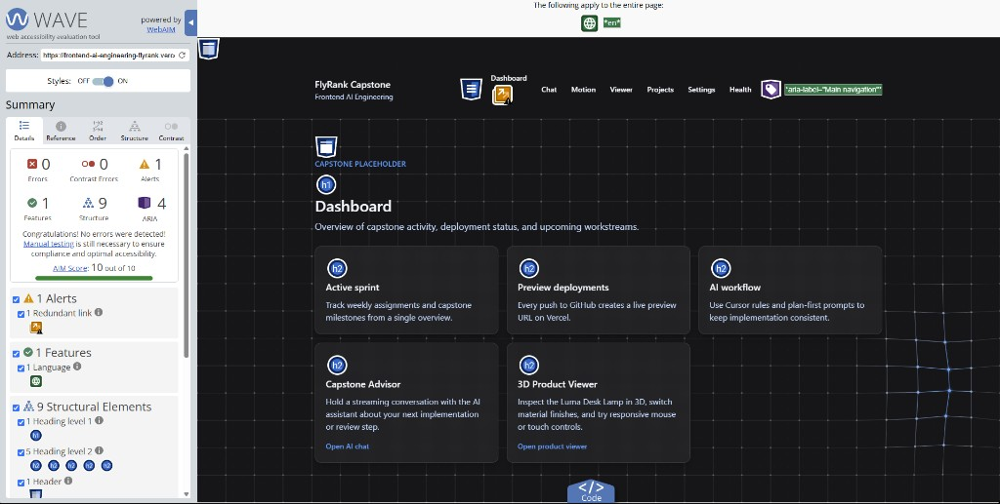
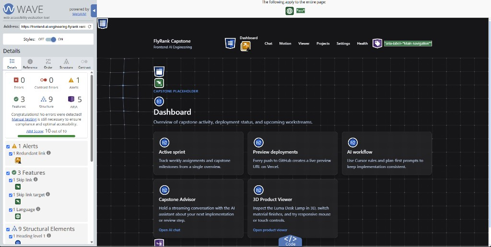

# FE-10 Accessibility and Performance Audit

## Environment and scope

- **Date:** 8 September 2026
- **Deployed URL:** https://frontend-ai-engineering-flyrank.vercel.app/
- **Lighthouse profile:** Mobile
- **Automated audit page:** Dashboard (`/`)
- **Interactive flows checked:** chat composer and Stop action, global navigation,
  product viewer color radios and Reset view

The same deployed URL and Lighthouse Mobile profile were used for the before
and after runs. WAVE screenshots cover the dashboard, while keyboard behavior
for the chat and viewer is covered by the focused component and Playwright
tests listed below.

## Lighthouse Mobile results

| Metric | Before | After | Delta |
| --- | ---: | ---: | ---: |
| Performance | 100 | 100 | 0 |
| Accessibility | 100 | 100 | 0 |
| Best Practices | 100 | 100 | 0 |
| SEO | 100 | 100 | 0 |

The score was already above the 90 target before the fixes. The changes focus
on keyboard and assistive-technology behavior that a score alone does not
fully represent, while preserving the 100/100 mobile result.

### Before

### After

## WAVE results

| Metric | Before | After | Delta |
| --- | ---: | ---: | ---: |
| Errors | 0 | 0 | 0 |
| Contrast errors | 0 | 0 | 0 |
| Alerts | 1 | 1 | 0 |
| Features | 1 | 3 | +2 |
| Structural elements | 9 | 9 | 0 |
| ARIA | 4 | 5 | +1 |

The remaining alert is WAVE's **redundant link** notice for the brand link and
the explicit Dashboard navigation link, which intentionally share the home
destination. The visible Dashboard item is retained so the global navigation
remains predictable; this is an alert, not a WAVE error.

### Before

### After

## Fixes applied

1. Added a visible-on-focus **Skip to main content** link and a focus target on
   the main landmark.
2. Added one polite, atomic chat announcer for response lifecycle updates.
   This avoids announcing every streamed token while still informing screen
   reader users that a response started and completed.
3. Moved focus to **Stop generating** when generation begins and added the
   Escape shortcut. The composer exposes `aria-keyshortcuts="Escape"`.
4. Made the conversation transcript a labelled, keyboard-focusable region.
5. Updated the 3D viewer Canvas description to name the Luma Desk Lamp.
   Color radios and Reset view remain available as keyboard alternatives to
   pointer-only 3D orbiting.
6. Changed the decorative KineticGrid animation to render continuously only
   during recent pointer interaction. It pauses for hidden tabs and
   `prefers-reduced-motion`, retaining a static background in those cases.

## Keyboard verification

- **Skip link:** the first Tab key lands on Skip to main content; Enter moves
  focus to the main landmark.
- **Chat:** the textarea has a programmatic label; Enter sends a valid message,
  focus moves to Stop during generation, and Escape stops generation.
- **Viewer:** Blue, Green, and Graphite are native radio controls; Reset view
  is a keyboard-operable button.
- **Motion:** the state triggers are native buttons with visible focus states.

## Regression checks

| Check | Result |
| --- | --- |
| `npm run lint` | Passed |
| `npm run test` | Passed: 17 tests |
| `npm run build` | Passed |
| `npm run test:e2e` | Passed: 4 tests |
