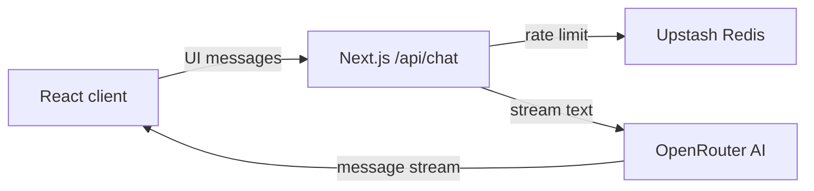

# Frontend AI Engineering - FlyRank

Capstone repository for the **Frontend AI Engineering** track at [FlyRank](https://flyrank.com/).

## About

This project explores AI-assisted frontend development workflows using modern tooling and best practices. The repository serves as the foundation for weekly assignments and the final capstone project.

## Prerequisites

| Tool | Version | Purpose |
|------|---------|---------|
| [Node.js](https://nodejs.org/) | LTS (v22+) | JavaScript runtime |
| [Git](https://git-scm.com/) | 2.x+ | Version control |
| [Cursor](https://cursor.com/) | Latest | AI-assisted IDE |

## Tech Stack

- **Framework:** Next.js 15 (App Router) + React 19 + TypeScript
- **Styling:** Tailwind CSS v4 with design tokens in `app/globals.css`
- **AI streaming:** Vercel AI SDK + OpenRouter Free Router
- **Abuse protection:** Upstash Redis + sliding-window rate limiting
- **Deployment:** Vercel preview deployments on every push
- **Version control:** Git + GitHub
- **IDE:** Cursor with project rules in `.cursor/rules/`
- **Commit style:** [Conventional Commits](https://www.conventionalcommits.org/)

## Getting Started

```bash
git clone https://github.com/808StaN/frontend-ai-engineering-flyrank.git
cd frontend-ai-engineering-flyrank
npm ci
cp .env.example .env.local
npm run dev
```

Open [http://localhost:3000](http://localhost:3000).

## Scripts

| Command | Description |
|---------|-------------|
| `npm run dev` | Start Next.js development server |
| `npm run build` | Build for production |
| `npm run start` | Run production server locally |
| `npm run lint` | Run ESLint (Next.js) |
| `npm run test` | Run Vitest component tests |
| `npm run test:watch` | Run Vitest in watch mode |
| `npm run test:e2e` | Run the Playwright chat flow after a production build |

## Routes

| Route | Screen |
|-------|--------|
| `/` | Dashboard |
| `/chat` | Streaming FlyRank Capstone Advisor |
| `/projects` | Projects list |
| `/projects/[projectId]` | Project detail |
| `/settings` | Settings placeholder |
| `/health` | Health-check (server fetch) |
| `/viewer` | Interactive 3D desk-lamp product viewer |

The dashboard introduces the project, `/chat` provides the streaming AI
workflow, `/motion` demonstrates button-state feedback, and `/viewer` is a
standalone interactive 3D product experience.

## Environment Variables

Copy `.env.example` to `.env.local` for local development, then provide values
for all required server-side services:

| Variable | Required | Used by | Purpose |
| --- | --- | --- | --- |
| `HEALTH_CHECK_API_URL` | Yes | `/health` | Public endpoint displayed by the health-check screen |
| `OPENROUTER_API_KEY` | Yes | `/api/chat` | Server-only key for OpenRouter streamed AI responses |
| `UPSTASH_REDIS_REST_URL` | Yes in production | `/api/chat` | Upstash REST endpoint for distributed rate limiting |
| `UPSTASH_REDIS_REST_TOKEN` | Yes in production | `/api/chat` | Server-only Upstash credential |

All secrets are server-side only and must never use a `NEXT_PUBLIC_` prefix.
Create the AI key in the [OpenRouter keys dashboard](https://openrouter.ai/keys)
and create a Redis database in the [Upstash console](https://console.upstash.com/).
Never commit `.env.local` or secret values.

## Streaming AI chat

The `/chat` route streams a multi-turn conversation through `app/api/chat/route.ts`.
The route uses the Vercel AI SDK and `openrouter/free`, while
`lib/ai/config.ts` centralizes the system prompt, model choice, and generation
configuration. The browser never receives the OpenRouter key.

### Capstone review tool

The `reviewCapstonePlan` server-side AI SDK tool evaluates a submitted
capstone plan and returns structured UI data rather than a JSON dump.

- **Input schema:** `title` (string), `description` (20–1500 characters),
  `stack` (1–8 technology names), and `stage`
  (`idea`, `planning`, `building`, `testing`, or `reviewing`).
- **Return shape:** `score` (0–100), `verdict`, `strengths`, `risks`, and
  `nextSteps`.
- **UI states:** the chat renders streamed tool input, ready input, structured
  output, and an execution error as separate accessible visual states.

Ask the chat to “review my capstone plan” and include those four input fields
to trigger the tool. To demonstrate its designed failure state, use
`[tool-error]` in the supplied plan title.

### Resilience checks

The chat keeps partial responses available after an interrupted stream and
provides a retry action for failed requests. Its empty state can prefill an
example prompt, and a skeleton appears while a response is being prepared.

For local manual verification, send one of these explicit test messages:

- `[[simulate:route-error]]` — returns a designed 503 error before streaming.
- `[[simulate:rate-limit]]` — returns 429 with a `Retry-After` header.
- `[[simulate:mid-stream-error]]` — renders partial assistant text, then a
  designed interrupted-stream error.

### Production request limits

`/api/chat` uses an Upstash Redis sliding-window limiter of 10 requests per
minute for each forwarded client IP. The limit is shared across Vercel
instances, unlike an in-memory counter, and rejected calls return `429` with a
`Retry-After` header. The route also rejects requests with more than 20
messages, more than 12,000 characters of text history, a latest message over
2,000 characters, or a serialized request larger than 64 KB. Streaming is
bounded to 30 seconds and the model is limited to 700 output tokens.

## Architecture and decisions



- The App Router keeps pages server-rendered by default while interactive
  surfaces, including chat and the shader, are isolated in client components.
- The AI provider, model ID, system prompt, and output limit live in
  `lib/ai/config.ts`, keeping credentials out of browser bundles.
- Upstash was selected because Vercel serverless instances cannot share an
  in-memory request counter. Route input caps and `maxDuration` provide
  additional cost and runtime bounds.
- The product viewer lazy-loads its Three.js canvas, while the fullscreen
  shader caps pixel density and respects reduced-motion preferences.

## Testing

The test suite covers the chat's accessible composer, streamed capstone-review
results, retry error notice, and the pending, streaming, and error states of
the chat interface. Tests locate elements by role, label, and visible text, so
they do not depend on Tailwind or CSS class names.

The Playwright primary-flow test opens `/chat`, submits a message, and
intercepts `/api/chat` with a deterministic AI SDK UI-message stream. It never
contacts OpenRouter or needs `OPENROUTER_API_KEY`. Run the complete local
verification in this order:

```bash
npm run lint
npm run test
npm run build
npm run test:e2e
```

GitHub Actions repeats the same checks on every push and pull request using
Node.js 22. Playwright reports and test result artefacts are ignored by Git.

## How AI tools built this

Cursor was used as an AI-assisted implementation partner for planning,
scaffolding components, and iterating on the chat, accessibility, 3D viewer,
and shader tasks. Each generated change was reviewed in the repository, tested
with linting, Vitest, production builds, and Playwright, then refined through
manual browser checks. Provider keys, deployment settings, and final merge
decisions remain human-controlled; AI tooling never receives or commits secret
values.

## Fullscreen shader hero

The application uses an original WebGL fullscreen shader as its background;
the dashboard (`/`) places its hero content over that canvas. The vertex shader
expands a pair of screen-filling triangles, while the fragment shader recreates
the visual language of the previous KineticGrid with a dark-blue lattice,
bright nodes, pointer-driven deformation, and an expanding blue ripple after
each click.

The shader receives `u_time` for gradual movement, `u_resolution` to preserve
the effect's aspect ratio, and `u_mouse` for pointer influence. Its render
resolution is capped at a device pixel ratio of 1.5, and its animation loop
stops when the browser tab is hidden. Users with `prefers-reduced-motion:
reduce` receive a static CSS grid instead, so the hero remains legible
without continuous motion.

## 3D product viewer

The `/viewer` route renders the **Luma Desk Lamp**, an interactive 3D desk
lamp. Drag to orbit the model, use the scroll wheel or a pinch gesture to zoom,
choose Blue, Green, or Graphite material finishes, and use the keyboard
accessible **Reset view** control to return to the default angle.

The model is procedural geometry rather than an external GLB. It is always
available, has no asset download or licensing cost, and keeps the product
payload substantially below a 400 KB model budget. The WebGL Canvas is loaded
only after entering `/viewer` with `next/dynamic` and no server-side rendering;
the route instead shows a useful visual fallback during loading or when WebGL
is unavailable.

The viewer caps device pixel ratio at 1.5 and uses a demand-driven render loop
with no auto-rotation. A desktop and 375px mobile review confirmed that the
finish controls and reset action remain available; the scene has no idle
animation, so it does not continuously consume frames when it is not being
used. Build output keeps the `/viewer` first-load JavaScript at 105 KB because
the Three.js Canvas remains in a lazy route chunk.

## Button state micro-interactions

The `/motion` route demonstrates a state-aware **Send message** button.
`Trigger success` and `Trigger error` each run a deterministic full lifecycle:
`idle → loading → success/error → idle`. The button and both triggers lock
during the sequence, preventing duplicate actions.

Motion is deliberately brief: hover uses 160 ms
`cubic-bezier(0.2, 0.8, 0.2, 1)`, press 100 ms `ease-out`, loading 220 ms
`ease-in-out`, success/error 260 ms `cubic-bezier(0.2, 0.8, 0.2, 1)`, and
reset 180 ms `ease-out`. These timings acknowledge an action immediately,
make the outcome readable, and then return control without delaying the next
interaction. The demo honours `prefers-reduced-motion` by retaining state
labels and colors while disabling animation.

## Deployment (Vercel)

1. Import the GitHub repository in [Vercel](https://vercel.com/) with the
   **Next.js** framework preset.
2. In Project Settings → Environment Variables, add all four variables from
   the environment table above to **Production**. Add them to Preview too when
   the chat must work on PR deployments.
3. In Deployment Protection, allow public access to the Production deployment.
   A reviewer must be able to open the URL without a Vercel account.
4. Merge `main` and use the Production deployment URL shown by Vercel. Every
   branch push still creates a Preview deployment for review before release.
5. Test the public URL in Chrome, Firefox, Safari, and on a mobile device:
   open the chat, send a message, confirm the streamed response, and open the
   mobile navigation menu.

No custom domain is required; Vercel's production URL is the canonical public
deployment address for this repository.

## Project Structure

```
frontend-ai-engineering-flyrank/
├── app/                    # App Router pages and layout
├── components/             # Shared UI components
├── lib/                    # Server utilities (health check, navigation)
├── public/
├── .cursor/rules/          # Cursor AI rules
├── .env.example
├── WORKFLOW.md             # FE-03 AI workflow comparison
└── README.md
```

## Development Workflow

1. Create a feature branch from `main`
2. Use Cursor Agent for implementation with project rules applied
3. Review AI-generated changes before committing
4. Follow [Conventional Commits](https://www.conventionalcommits.org/) for all commits
5. Push to trigger a Vercel preview deployment

## License

This project is licensed under the MIT License — see [LICENSE](LICENSE) for details.
